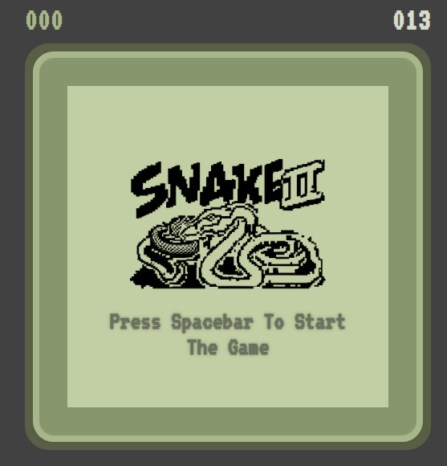

# Classic Snake Game

A nostalgic implementation of the classic Snake game with a retro aesthetic, built using vanilla JavaScript, HTML, and CSS.



## Features

- Responsive game board with retro-styled UI
- Progressive difficulty (snake speeds up as you eat more food)
- Score tracking with local storage for high score persistence
- Game audio including background music and sound effects
- Authentic retro-style visuals with pixel font and animations

## How to Play

1. Press the spacebar to start the game
2. Use the arrow keys to control the snake:
   - ↑ Move Up
   - ↓ Move Down
   - ← Move Left
   - → Move Right
3. Eat the food to grow longer and increase your score
4. Avoid hitting the walls or your own tail
5. When game over occurs, press any key to restart

## Game Controls

- **Spacebar**: Start game
- **Arrow Keys**: Navigate the snake
- **Any Key**: Restart after game over

## Technical Implementation

The game is built with:

- **HTML5** for structure
- **CSS3** for styling with animations
- **JavaScript** for game logic and interactivity

### Core Game Mechanics

- Grid-based movement system
- Collision detection for walls and snake body
- Dynamic food generation
- Speed progression algorithm
- Game state management

## Project Structure

```
snake-game/
├── index.html          # Main game structure
├── style.css           # Game styling and animations
├── script.js           # Game logic and controls
├── snake-game-ai-gen.png  # Game logo
├── bg-music.mp3        # Background music
├── eat.ogg             # Food consumption sound
└── game-over.wav       # Game over sound
```

## Installation

No installation required! Simply clone the repository and open `index.html` in your browser:

```bash
git clone https://github.com/yourusername/snake-game.git
cd snake-game
# Open index.html in your browser
```

## Credits

- Font: [VT323](https://fonts.google.com/specimen/VT323) from Google Fonts
- Sound effects from [OpenGameArt.org](https://opengameart.org/)

## License

This project is available under the MIT License.

---

Enjoy the game and happy coding!
